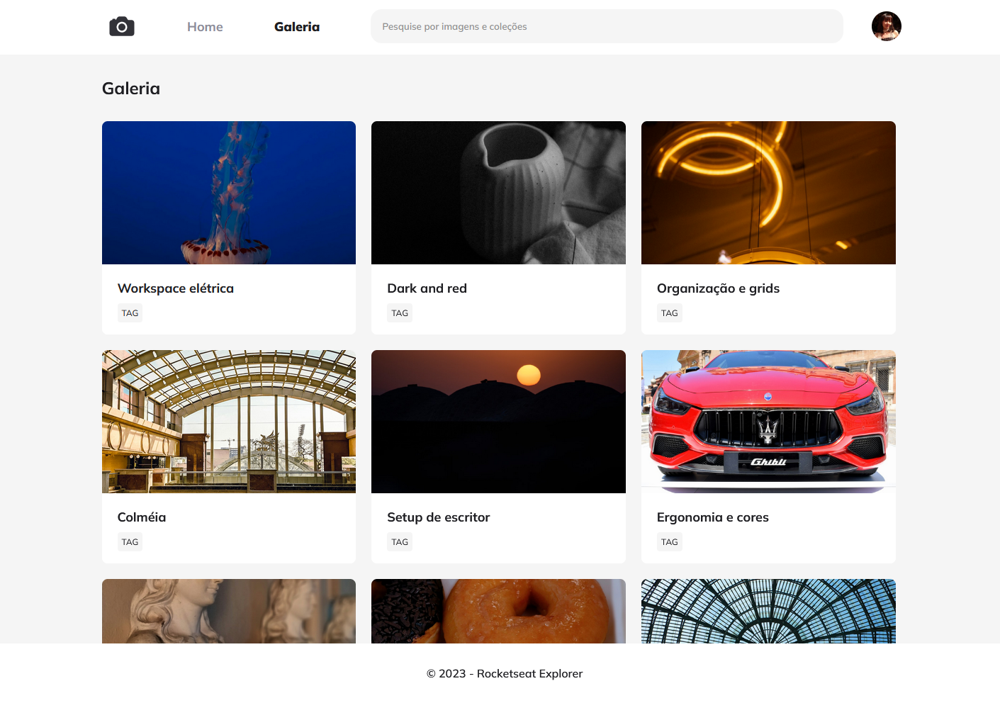

# Projeto de criar um blog utilizando algumas características avançadas do CSS
Sendo elas: Grid, Variáveis, API que gera imagens aleatórias, modo de formatar sem perder a qualidade, acessibilidade no placeholder, proporção de imagem, filtro, animação no CSS e cor com HSL

# Projeto final




# font-smoothing
- deixa a fonte das letras mais "smooth"
```
* {

  margin: 0;

  padding: 0;

  box-sizing: 0;

  -webkit-font-smoothing: antialiased;

  -moz-osx-font-smoothing: grayscale;

}
```
# grid-template-rows: max content
- Vai crescer conforme o tamanho do conteudo embutido
```
#app {

  display: grid;

  grid-template-rows: max-content 1fr max-content;

  height: 100vh;

}
```
# Estrutura em grid com header e footer fixos
- Nesse caso, precisamos criar uma class para header e footer sendo igual, dentro do "main" criamos a tag igual, porem dentro de uma div, assim basta colocar: overflow-y: scroll
```
<body>

  <div id="app">

    <header class="container">

      header

    </header>

    <main>

      <div class="container">

        main

      </div>

    </main>

    <footer class="container">

      footer

    </footer>

  </div>

</body>
```
- No css
```
main {

  background-color: gray;

  overflow-y: scroll;

}
```

# Variáveis CSS
- colocamos normalmente no css root -> :root
- depois dos -- coloca-se o nome que facilita o entendimento
- para chamar a variável coloca-se: var()
```
:root {

  font-size: 62.5%;

  

  --color-base-white: #ffffff;

  --color-base-gray-100: #f5f5f5;

  --color-base-gray-300: #8d8d99;

  --color-base-gray-900: #202024;

}
```
- Para utilizar
```
  background-color: var(--color-base-gray-100) ;
```

# api para gerar img aleatória - tipos
```
      
```
```
            
```
# Formatação de imagem sem perder qualidade: object-fit: cover
```
.avatar {

  width: 4.2rem;

  height: 4.2rem;

  

  object-fit: cover;

  

  border-radius: 50%;

}
```
# Acessibilidade no forms com placeholder
- No forms o placeholder não é lido pelo navegador, para ser interpretado precisa ser feito dentro do label a frase que fica no placeholder e fazer com que fique escondido.
- Para tal, coloca-se um width e height de 1px com overflow hidden e position absolute
```
.input-wrapper label {

  width: 1px;

  height: 1px;

  overflow: hidden;

  position: absolute;

}
```
# Proporção de imagem com aspect ratio
- Para ajustar a imagem conforme uma padronização de proporção, optar por escolher enquadramentos padrões. 16/9, 4/3 9/16. etc
```
.item img {

  width: 100%;

  aspect-ratio: 16/9;

  object-fit: cover;

}
```

# Imagem não enquadra corretamente - overflow
- Serve para deixar a imagem enquadrar corretamente ao utilizar o border-radius
- Utiliza-se o overflow: hidden
```
.item {

  background-color: var(--color-base-white);

  border-radius: 0.8rem;

  overflow: hidden;

}
```

# Filtro CSS - filter
- Serve para aplicar filtro nas imagens. Há diversos filtros que podem ser utilizados, como saturação, contraste, gray scale, etc.
- A ideia mais pertinente é aplicar um hover e com isso a img alterar

```
.item img:hover {

  filter: hue-rotate(7deg) contrast(101%) saturate(200%);

}
```
```
.logo {

  filter:saturate(200%)  brightness(2) hue-rotate(90deg);

}
```

# CSS Transition
- Para realizar a transição posso utilizar a função de filtro e transform
- Com isso, posso definir quais são as propriedades afetadas, a duração, o delay pra acontecer e o tipo de timing
## Transition-timing-function
- Há a opção de ease-in, ease-in-out e ease-out como principais modos de utlizar.
```
.item img {

  width: 100%;

  aspect-ratio: 16/9;

  object-fit: cover;

  

  transition-property: transform,filter;

  transition-duration: 200ms;

  transition-delay: 0;

  transition-timing-function:ease-out;

  

}

  

.item img:hover {

  filter: hue-rotate(7deg) contrast(101%) saturate(200%);

  transform: scale(1.1) rotate(-2deg);

}
```
```
  transition: all 200ms ease-out;
```
# CSS Animation
- https://animista.net/
```
.square {

  animation-name: move;

  animation-duration: 1s;

  animation-fill-mode: forwards;

}

  

@keyframes move {

  0% {

  
  

  }

  

  100% {

    transform: translateX(calc(100vw - 100% - 16px));    

  }

}
```
## Animation name
- Dentro do objeto que precisa ter animação, colocar essa proproiedade
## Animation-duration
- Duração da Animação
## ANIMATION-FILL-MODE
- Modo que a ação vai ficar ao completar seu movimento
## from e to 
- Define o ponto inicial e o ponto final da aplicação
## @keyframe define o nome da animação

## animation-direction
- Define a direção da animação
### animation-direction-alternate 
- Possibilita alterar a direação
## Animation-interation-count
- Possibilita definir a quantidade de vezes que o objeto anima
- Para ficar infinito, basta colocar como "infinite"
```
.square {

  animation-name: move;

  animation-duration: 1s;

  animation-fill-mode: forwards;

  animation-direction:alternate;

  animation-iteration-count: infinite;

}
```
## animation-delay
- Define o delay para a ação começar ou não
## animation-timing-function
- Tem 2 opções a primeira seria definir pelos modo: ease, ease-in, ease-out, ease-in-out
- tem o linear que fica muito smooth o movimento
- Aplicar o outro método que seria por steps
- cubic-bezier -> movimentos customizados
```
.square {

  animation-name: move;

  animation-duration: 1s;

  animation-fill-mode: forwards;

  animation-direction:alternate;

  animation-iteration-count: infinite;

  animation-delay: ;

  animation-timing-function:cubic-bezier(0.175, 0.885, 0.32, 1.275);

}
```
## animation-play-estate:pause com hover
- Faz com que ao deixar o mouse em cima

## Pode haver mais de uma animação em um mesmo objeto
```
.square {

  animation-name: move, blink;

  animation-duration: 1s, 200ms;

  animation-fill-mode: forwards;

  animation-direction: alternate;

  animation-iteration-count: infinite;

  /* animation-delay: 2s; */

  animation-timing-function: steps(10);

}

  

.square:hover {

  animation-play-state:paused;

}

  

@keyframes move {

  /* to */

  100% {

    transform: translateX(calc(100vw - 100% - 16px));

  }

}

  

@keyframes blink {

  0%, 100% {

    opacity: 0.6;

  }

  

  50% {

    opacity: 1;

  }

}
```

## short hand
```
`animation: move 1s forwards alternate infinite, blink 100ms infinite;`
```

## Animações no projeto
```
@keyframes move {

  from {

    transform: translateY(var(--startY));

  }

}

  

.item {

  --delay: 0.4s;

  animation: appear 0.4s var(--delay) backwards;

}

  

@keyframes appear {

  0% {

    opacity: 0;

    transform: scale(0.7);

  }

  

  50% {

    transform: scale(1.2);

  }

}
```
# Alterando tom de cores totais com HSL
- Serve para mudar toda a tonalidade de cores ao mexer apenas em uma propriedade que seria o HUE
- A última propriedade é aquela que faz a saturação
- ![[I5rGs.png]]
```
:root {

  font-size: 62.5%;

  
  

  --hue: 240;

  --color-base-white: hsl(0, 0%, 100%);

  --color-base-gray-100: hsl(0, 0%, 96%);

  --color-base-gray-300: hsl(var(--hue), 6%, 58%);

  --color-base-gray-500: hsl(0, 0%, 24%);

  --color-base-gray-900: hsl(var(--hue), 6%, 13%);

  

}
```
